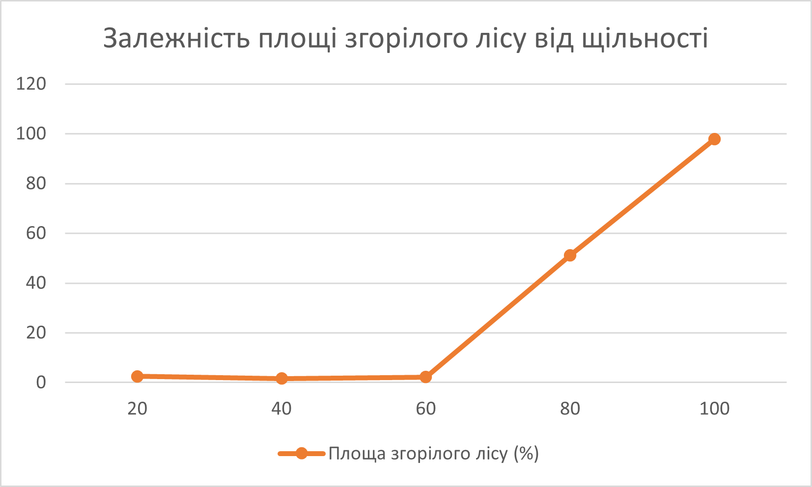
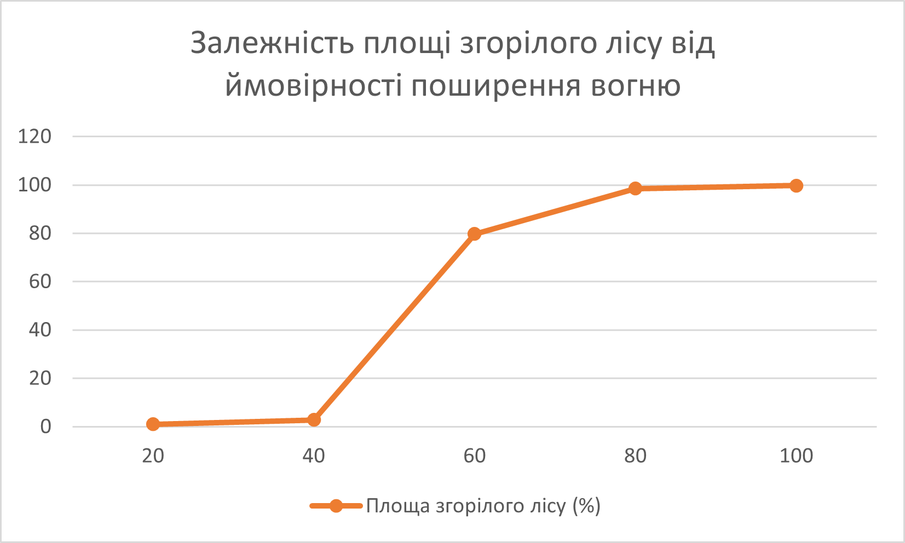
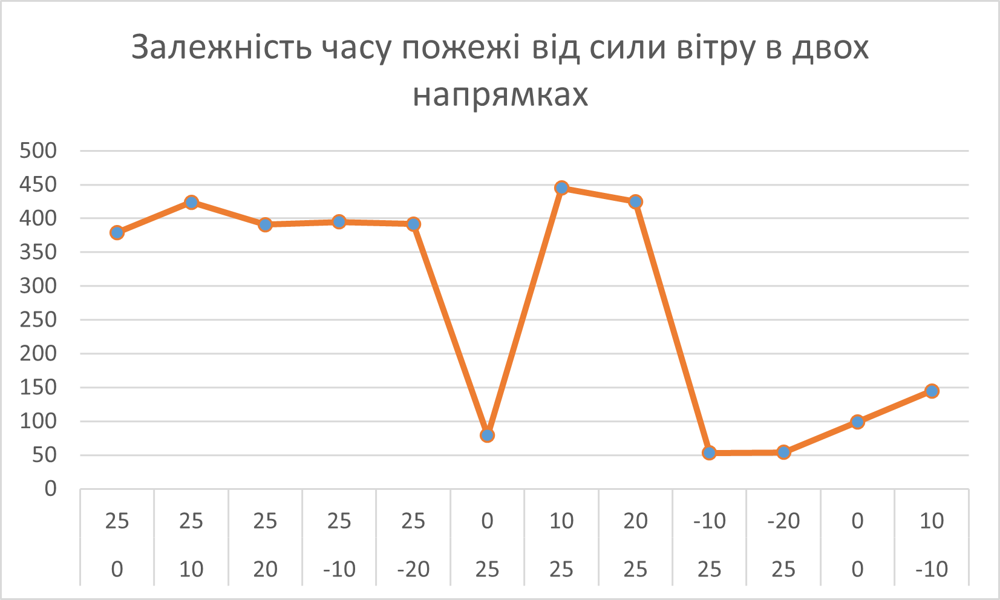

## Комп'ютерні системи імітаційного моделювання

## СПм-23-3, **Сергеєв Данило Володимирович**

### Лабораторна робота №**1**. Опис імітаційних моделей та проведення обчислювальних експериментів

 

### Варіант 5, модель у середовищі NetLogo:

[Fire Simple Extension 2](http://www.netlogoweb.org/launch#http://www.netlogoweb.org/assets/modelslib/IABM%20Textbook/chapter%203/Fire%20Extensions/Fire%20Simple%20Extension%202.nlogo)

 

### Вербальний опис моделі:

Модель симулює поширення вогню через ліс і демонструє, як сила вітру впливає на поширення пожежі. Ліс представлений як сітка клітинок (певних ділянок, кожна з яких може бути деревом), де кожне дерево має шанс загорітися, якщо його сусіднє дерево вже горить. Ця модель є модифікацією попередньої Fire Simple Extension 1, додаючи елемент вітру, що змінює ймовірність загоряння дерев в залежності від напрямку та сили вітру.

### Керуючі параметри:

- **density** регулює щільність дерев у лісі, що впливає на кількість зелених клітин на початку симуляції; чим більша щільність, тим більше дерев у лісі.
- **probability-of-spread** визначає ймовірність того, що вогонь перекинеться з одного дерева на інше. Його можна змінювати, щоб контролювати, наскільки швидко або повільно поширюється пожежа.
- **south-wind-speed** впливає на те, як вітер з півдня або з півночі змінює ймовірність поширення вогню. Якщо значення позитивне, це означає, що вітер дме з півдня, якщо ж значення від’ємне, це означає, що вітер дме з півночі.
- **west-wind-speed** регулює вітер з заходу або зі сходу, і його вплив на поширення вогню. Позитивне значення означає, що вітер дме із заходу, якщо ж значення негативне, це вказує на вітер зі сходу.

### Внутрішні параметри:

- **initial-trees** показує скільки дерев було на початку симуляції. Іншими словами, з якою кількістю буде починатись симуляція.
- **probability** визначає ймовірність розповсюдження вогню, враховуючи силу вітру.
- **direction** напрямок від поточного зеленого дерева до палаючого дерева.

### Показники роботи системи:

- відсоток згорілих дерев, що дозволяє оцінити масштаб руйнування лісу.
- швидкість поширення вогню, яка залежить від налаштувань ймовірності поширення та впливу вітру.

### Примітки:

В моделі поширення вогню є випадковим процесом, і результати можуть значно змінюватися при кожному запуску моделі через різні початкові умови та налаштування параметрів. Вітер є ключовим фактором, який може як пришвидшити, так і сповільнити поширення вогню в різних напрямках.

### Недоліки моделі:

Недоліком системи можна вважати спрощеність. Модель не враховує багато реальних факторів, які впливають на поширення пожежі, таких як вологість повітря, типи рослинності, ландшафт або погодні умови, крім вітру. Вітер у моделі є дуже спрощеним і враховується лише у двох напрямах — південь-північ і захід-схід, що не відображає складніші варіації напрямків вітру у реальних умовах (зміна напрямку або сили з часом). Також модель працює на сітці з фіксованими розмірами, що обмежує масштаб симуляції і не дозволяє моделювати дуже великі або різнорідні території. Крім того, модель не враховує людський фактор, наприклад, дії пожежників, або природні перепони, такі як річки або дороги, які можуть обмежувати поширення вогню.

 

## Обчислювальні експерименти

### 1. Вплив щільності дерев на площу згорілого лісу

Досліджується залежність площі згорілого лісу від щільності дерев, зазначеної на початку симуляції. Експерименти проводяться при п'яти значеннях щільності: дуже низька (20%), низька (40%), середня (60%) висока (80%), дуже висока (100%). Усього буде проведено 5 симуляцій. Кожна симуляція триватиме до завершення пожежі, після чого буде виміряно площу згорілого лісу. Інші керуючі параметри матимуть значення за замовчуванням:

- **probability-of-spread**: 57
- **south-wind-speed**: 25
- **west-wind-speed**: 25

<table>
<thead>
<tr><th>Щільність лісу (%)</th><th>Площа згорілого лісу (%)</th><th>Час (ticks)</th></tr>
</thead>
<tbody>
<tr><td>20</td><td>2.5</td><td>5</td></tr>
<tr><td>40</td><td>1.6</td><td>14</td></tr>
<tr><td>60</td><td>2.2</td><td>33</td></tr>
<tr><td>80</td><td>51.1</td><td>436</td></tr>
<tr><td>100</td><td>97.8</td><td>290</td></tr>
</tbody>
</table>

Графік наочно показує, що плоша згоряння лісу починає приймати великі показники починаючи з 80% щільності. Найбільший показник був при 100% щільності.

### 2. Вплив ймовірності поширення вогню на площу згорілого лісу

Досліджується залежність площі згорілого лісу від ймовірності поширення вогню. Експерименти проводяться при п'яти значеннях ймовірності: 20%, 40%, 60%, 80% та 100%. Усього буде проведено 5 симуляцій для кожного значення ймовірності. Кожна симуляція триватиме до повного вигоряння лісу, після чого буде виміряно площу згорілого лісу. Інші керуючі параметри матимуть значення за замовчуванням:

- **density**: 82
- **south-wind-speed**: 25
- **west-wind-speed**: 25

<table>
<thead>
<tr><th>Ймовірність поширення вогню (%)</th><th>Площа згорілого лісу (%)</th><th>Час (ticks)</th></tr>
</thead>
<tbody>
<tr><td>20</td><td>1</td><td>17</td></tr>
<tr><td>40</td><td>2.8</td><td>47</td></tr>
<tr><td>60</td><td>79.7</td><td>375</td></tr>
<tr><td>80</td><td>98.5</td><td>295</td></tr>
<tr><td>100</td><td>99.8</td><td>292</td></tr>
</tbody>
</table>

Графік наочно показує, що плоша згоряння лісу починає приймати великі показники починаючи з 60% ймовірності поширення вогню. Найбільший показник був в діапазоні від 80% до 100%.

### 3. Вплив сили вітру на час поширення вогню

Досліджується вплив сили вітру на час поширення вогню в лісі. Експерименти проводяться з п’ятьма різними комбінаціями швидкостей вітру: без вітру (0 одиниць), південний вітер (позитивні значення: 10 і 20 одиниць), північний вітер (негативні значення: -10 і -20 одиниць), західний вітер (позитивні значення: 10 і 20 одиниць) та східний вітер (негативні значення: -10 і -20 одиниць). Усього буде проведено 10 симуляцій для кожного з п’яти значень вітру та додатково буде проведено 2 симуляції, в яких будуть комбінації значень вітру в двох параметрах. У кожній симуляції буде зафіксовано час поширення вогню до його повного вигоряння. Інші керуючі параметри матимуть значення за замовчуванням:

- **density**: 82
- **probability-of-spread**: 57

<table>
<thead>
<tr><th>Швидкість південного вітру</th><th>Швидкість західного вітру</th><th>Час (ticks)</th></tr>
</thead>
<tbody>
<tr><td>0</td><td>25</td><td>379</td></tr>
<tr><td>10</td><td>25</td><td>424</td></tr>
<tr><td>20</td><td>25</td><td>391</td></tr>
<tr><td>-10</td><td>25</td><td>395</td></tr>
<tr><td>-20</td><td>25</td><td>392</td></tr>
<tr><td>25</td><td>0</td><td>79</td></tr>
<tr><td>25</td><td>10</td><td>445</td></tr>
<tr><td>25</td><td>20</td><td>425</td></tr>
<tr><td>25</td><td>-10</td><td>53</td></tr>
<tr><td>25</td><td>-20</td><td>54</td></tr>
<tr><td>0</td><td>0</td><td>99</td></tr>
<tr><td>-10</td><td>10</td><td>145</td></tr>
</tbody>
</table>

За графіком можна побачити, що найбільш впливовим є силу західного вітру. При негативних значеннях або тих що наближуються до 0, час стає максимально малим. Південний вітер лише спрямовує пожежу, проте в цілому ніяк не впливає на час.
