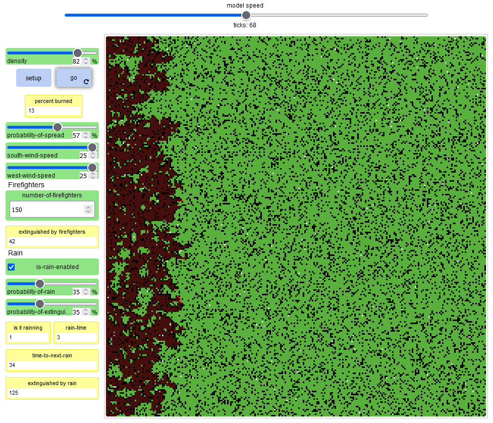
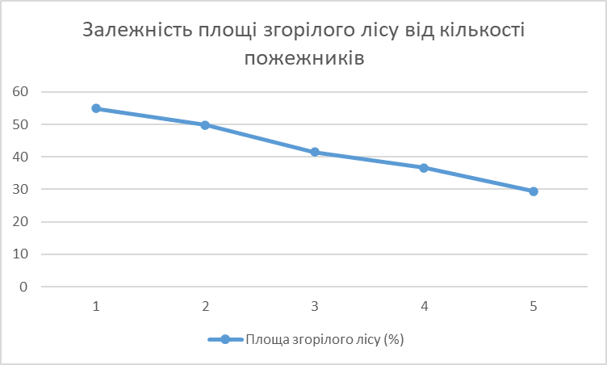
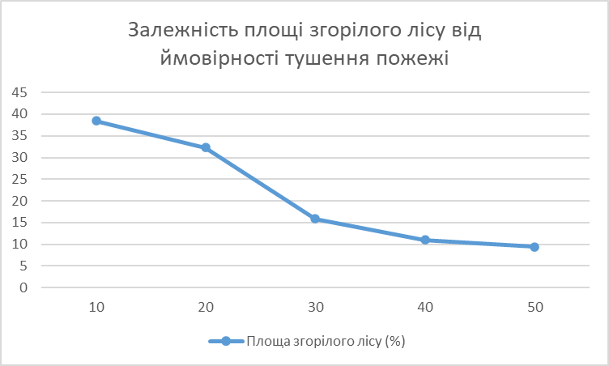

## Комп'ютерні системи імітаційного моделювання
## СПм-23-3, **Сергеєв Данило Володимирович**
### Лабораторна робота №**2**. Редагування імітаційних моделей у середовищі NetLogo

 

### Варіант 5, модель у середовищі NetLogo:
[Fire Simple Extension 2](http://www.netlogoweb.org/launch#http://www.netlogoweb.org/assets/modelslib/IABM%20Textbook/chapter%203/Fire%20Extensions/Fire%20Simple%20Extension%202.nlogo)

 

### Внесені зміни у вихідну логіку моделі, за варіантом:
**Додавання агентів-пожежників** передбачає створення нового елементу керування "Slider", для того, щоб користувач міг власноруч налаштовувати кількість пожежників на початку. Також додатково можна додати елемент "Monitor", для відображення загальної кількості клітинок які потушили пожежники. Після цього необхідно додати до ініціалізації додати виклик процедури створення пожежників
<pre>
to setup-firefighters
  if number-of-firefighters < 0 [
    user-message (word
      "Number of firefighters cannot be below 0. "
      "Please increse the NUMBER-OF-FIREFIGHTERS value "
      "and press the SETUP button again. "
      "The setup has stopped.")
    stop
  ]
  if number-of-firefighters > count patches with [pcolor = black] [
    user-message (word
      "There are too many firefighters. "
      "Please decrease the NUMBER-OF-FIREFIGHTERS value "
      "and press the SETUP button again. "
      "The setup has stopped.")
    stop
  ]
  set-default-shape turtles "circle"
  create-turtles number-of-firefighters [
    set color white
    set-correct-place
  ]
end
</pre>
у цій процедурі, виконується встановлення фігури агента, колір та після цього викликається інша процедура, що виконує розміщення агента на будь-яких пустих клітинках за умови, що іншого пожежника не має на цій клітинці
<pre>
to set-correct-place
  let spawn-patch one-of patches with [pcolor = black]
  if spawn-patch != nobody [
    move-to spawn-patch
  ]
end
</pre>
**Додавання логіки пожежників** це наступний крок у реалізації пожежників. Для початку кожен пожежник намагається виконати переміщення на будь-яку сусідню позицію, за умови, що вона є деревом або пустою клітинкою. Після переміщення, якщо в сусідній клітинці є вогонь, то пожежник буде його тушити
<pre>
ask turtles [
  let target-patch one-of neighbors4 with [pcolor = green or pcolor = black]
  if target-patch != nobody [
    move-to target-patch
  ]
  ask neighbors4 with [pcolor = red] [
    set pcolor black
    set extinguished-by-firefighters extinguished-by-firefighters + 1
  ]
]
</pre>

 

### Внесені зміни у вихідну логіку моделі, на власний розсуд:
**Додавання дощу до симуляції** це друга модифікація моделі. Для початку так само як і в попередньому кроці було створено елементи керування. Першим був "Switch", для того, щоб вмикати або вимикати можливість дощу. Далі йдуть два "Slider", для вказання вірогідності того, що почнеться дощ, та вірогідності того, що дощ потушить вогонь відповідно. Також на етапі ініціалізації додано виклик процедури, що налаштовує початкові параметри дощу
<pre>
to setup-rain
  set is-it-raining false
  set-time-to-next-rain
end
</pre>
у ній відбувається інший виклик процедури, що націлена на встановлення часу для наступного дощу. Формально є часом, в період якого не може початися новий дощ
<pre>
to set-time-to-next-rain
  set time-to-next-rain rain-time + 30 + random 30
end
</pre>
**Створення логіки дощу** важлива частина цього компоненту. Кожен тік, відбувається спроба почати дощ, що залежить від вірогідності та від того чи пройшло достатньо часу після попереднього дощу. Також відбувається зупинка, якщо час дощу закінчився
<pre>
if is-rain-enabled and time-to-next-rain <= 0 [
    set is-it-raining random 100 < probability-of-rain
    if is-it-raining [
      set-rain-time
      set-time-to-next-rain
    ]
  ]
set is-it-raining rain-time > 0
</pre>
після цього необхідно примінити дощ до моделі. Для цього під час проходження по всім клітинкам, що є вогнем, відбувається перевірка чи вдалося дощу потушити вогонь (відбувається пряма залежність від вірогідності)
<pre>
let is-fire-extinguishing false
if is-it-raining [
  set is-fire-extinguishing random 100 < probability-of-extinguishing
]
</pre>
після цього відбдувається або процес тушення пожежі або продовження логіки за замовчуванням
<pre>
ifelse is-fire-extinguishing [
      set pcolor black
      set extinguished-by-rain extinguished-by-rain + 1
    ] [...]
</pre>
останнім кроком є зміна часу, для того, щоб зупинити дощ в певний момент
<pre>
if rain-time != 0 [
    set rain-time rain-time - 1
  ]
if time-to-next-rain != 0 [
  set time-to-next-rain time-to-next-rain - 1
  ]
</pre>

Фінальний код моделі та її інтерфейс доступні за [посиланням](LB_2.nlogo)

 

## Обчислювальні експерименти
### 1. Вплив пожежників на розповсюдження вогню
Досліджується залежність площі згорілого лісу від роботи пожежників. Експерименти проводяться при п'яти значеннях кількості пожежників: 250, 500, 750, 100, 1250. Усього буде проведено 5 симуляцій. Кожна симуляція триватиме до завершення пожежі, після чого буде виміряно площу згорілого лісу. Інші керуючі параметри матимуть значення за замовчуванням:

- **density**: 82
- **probability-of-spread**: 57
- **south-wind-speed**: 25
- **west-wind-speed**: 25
- **is-rain-enabled**: false
- **probability-of-rain**: 35
- **probability-of-extinguishing**: 35

<table>
<thead>
<tr><th>Кількість пожежників</th><th>Площа згорілого лісу (%)</th><th>Час (ticks)</th></tr>
</thead>
<tbody>
<tr><td>250</td><td>54.9</td><td>406</td></tr>
<tr><td>500</td><td>49.8</td><td>412</td></tr>
<tr><td>750</td><td>41.5</td><td>473</td></tr>
<tr><td>1000</td><td>36.6</td><td>384</td></tr>
<tr><td>1250</td><td>29.4</td><td>437</td></tr>
</tbody>
</table>

За графіком можна побачити, що зі збільшенням кількості пожежників зменшується площа згорілого лісу, та час.

### 2. Вплив дощу на розповсюдження вогню
Досліджується залежність площі згорілого лісу від дощу. Експерименти проводяться при п'яти значеннях вірогідності тушення пожежі: 10, 20, 30, 40, 50. Усього буде проведено 5 симуляцій. Кожна симуляція триватиме до завершення пожежі, після чого буде виміряно площу згорілого лісу. Кількість пожежників встановлено в 0. Інші керуючі параметри матимуть значення за замовчуванням:

- **density**: 82
- **probability-of-spread**: 57
- **south-wind-speed**: 25
- **west-wind-speed**: 25
- **probability-of-rain**: 35

<table>
<thead>
<tr><th>Ймовірність тушення пожежі (%)</th><th>Площа згорілого лісу (%)</th><th>Час (ticks)</th></tr>
</thead>
<tbody>
<tr><td>10</td><td>38.4</td><td>405</td></tr>
<tr><td>20</td><td>32.3</td><td>475</td></tr>
<tr><td>30</td><td>15.9</td><td>238</td></tr>
<tr><td>40</td><td>11</td><td>60</td></tr>
<tr><td>50</td><td>9.4</td><td>52</td></tr>
</tbody>
</table>

За графіком можна побачити, що дощ впливає краще на пожежу при збільшенні ймовірності.